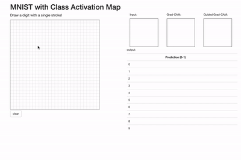

# Grad-CAM for MNIST dataset

2019-06-02

This Flask app was inspired by [https://github.com/sugyan/tensorflow-mnist](https://github.com/sugyan/tensorflow-mnist) and [https://github.com/eclique/keras-gradcam](https://github.com/eclique/keras-gradcam). You can visualize Grad-CAM as well as Guided Grad-CAM based on your stroke input. This app is not optimized. Feel free to edit and explore.


## How to run
```bash
$ python app.py
```



## TODO
- [x] Clear 'clear' prediction (no output or update)
- [x] Fix table row index (make it appear correctly!)
- [x] Add Guided Grad-CAM

- [] Train MNIST with data augmentation (See: [https://machinelearningmastery.com/image-augmentation-deep-learning-keras/](https://machinelearningmastery.com/image-augmentation-deep-learning-keras/)), especially with rotation and shifts.
- [] Exchange image data directly between python and javascript, not via file system.
